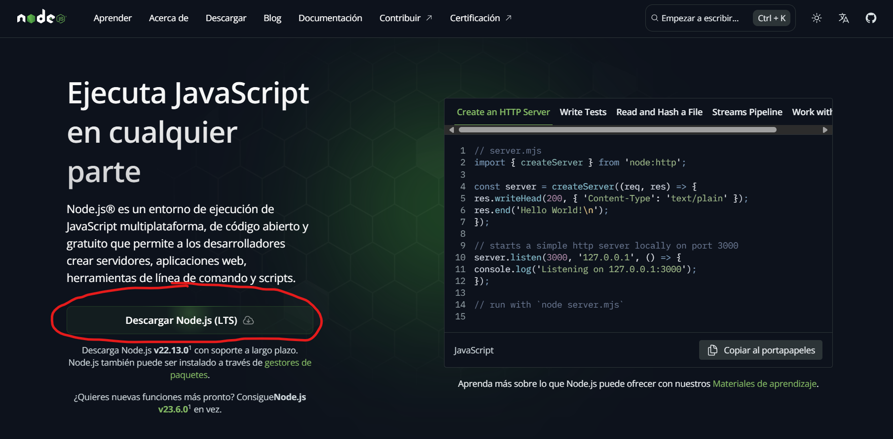
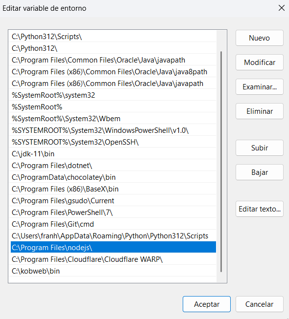

# 1. Explica o muestra el proceso de instalación de node, teniendo en cuenta los errores comunes con el path:
1. Descarga el instalador desde [nodejs.org](https://nodejs.org/es).  
    

2. Ejecuta el archivo descargado. Acepta los términos y elige la ruta de instalación.  
    

3. Activa la casilla que actualiza la variable de entorno “Path” si aparece.  


4. Finaliza la instalación y abre la terminal. Ejecuta:  
    ```
    node -v
    npm -v
    ```
    Esto confirma la instalación correcta.

5. Si “node” no se reconoce, agrega manualmente la ruta de Node.js en “Path”. En Windows 11:  
    • Pulsa Windows + R y escribe “SystemPropertiesAdvanced”.  
    • Selecciona “Variables de entorno” y en "Variables del Sistema" -> "Path", añade la carpeta de instalación de Node.js.  
    


Otra opción, en Windows 10 o Windows 11, es abrir PowerShell (Terminal en Windows 11) y ejecutar:
```
winget install --id=OpenJS.NodeJS.LTS  -e
```
Node.js estará instalado y funcionando en el sistema.