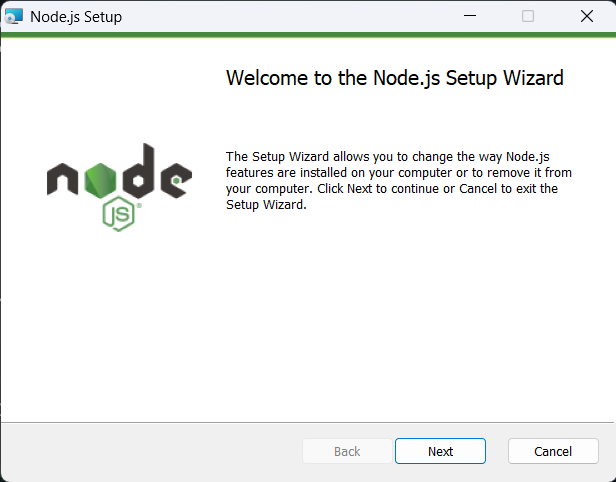
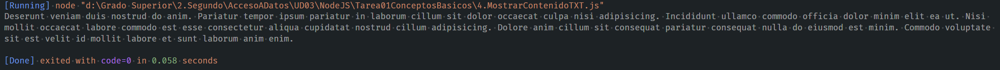

# Enunciados y Respuestas con capturas:

## 1. Instalación de Node.js en Windows 10 y Windows 11

1. Descarga el instalador desde [nodejs.org](https://nodejs.org/es).  
    

2. Ejecuta el archivo descargado. Acepta los términos y elige la ruta de instalación.  
    

3. Activa la casilla que actualiza la variable de entorno “Path” si aparece.  


4. Finaliza la instalación y abre la terminal. Ejecuta:  
    ```
    node -v
    npm -v
    ```
    Esto confirma la instalación correcta.

5. Si “node” no se reconoce, agrega manualmente la ruta de Node.js en “Path”. En Windows 11:  
    • Pulsa Windows + R y escribe “SystemPropertiesAdvanced”.  
    • Selecciona “Variables de entorno” y en "Variables del Sistema" -> "Path", añade la carpeta de instalación de Node.js.  
    


Otra opción, en Windows 10 o Windows 11, es abrir PowerShell (Terminal en Windows 11) y ejecutar:
```ps1
winget install --id=OpenJS.NodeJS.LTS  -e
```
Node.js estará instalado y funcionando en el sistema.

## 2. Crea una función sencilla que imprima '¡Hola, Mundo!' en la terminal.
```js
function holaMundo(){
    console.log("¡Hola Mundo!");
}
holaMundo(); // Imprime ¡Hola Mundo!
```


## 3. Crea una función que tome dos números como argumentos e imprima su suma.
```js
function sumaDosArgumentos(a, b) {
    console.log(a + b);
}
// Ejemplo de uso
sumaDosArgumentos(3, 5); // Imprime 8
```


## 4. Crea una función que lea un archivo de texto llamado 'data.txt' y muestre su contenido en la consola.
```js
var fs = require('fs');
var path = require('path');

var dir = path.join(__dirname, 'archivos_txt');
var filePath = path.join(dir, 'data.txt');

function leerArchivo() {
    fs.readFile(filePath, 'utf8', function(err, data) {
        if (err) {
            return console.log(err);
        }
        console.log(data);
    });
}

leerArchivo(); // Imprime el contenido del archivo data.txt
```


## 5. Crea una función que escriba el texto "Hola, mundo" en un archivo llamado output.txt.
```js
var fs = require('fs');
var path = require('path');

var dir = path.join(__dirname, 'archivos_txt');
var filePath = path.join(dir, 'output.txt');

if (!fs.existsSync(dir)) {
    fs.mkdirSync(dir);
}

if (!fs.existsSync(filePath)) {
    fs.writeFileSync(filePath, '');
    console.log("Archivo creado.");
}

function escribirArchivo() {
    fs.writeFile(filePath, "Hola Mundo", function(err) {
        if (err) {
            return console.log(err);
        }
        console.log("Escrito en el archivo output.txt");
    });
}

escribirArchivo(); // Imprime el contenido del archivo data.txt
```


## 6. Crea una función que sobrescriba el archivo log.txt con el texto "Actualización completada".
```js
var fs = require('fs');
var path = require('path');

var dir = path.join(__dirname, 'archivos_txt');
var filePath = path.join(dir, 'log.txt');

if (!fs.existsSync(dir)) {
    fs.mkdirSync(dir);
}

if (!fs.existsSync(filePath)) {
    fs.writeFileSync(filePath, '');
    console.log("Archivo creado.");
}

function sobreescribirArchivo() {
    fs.writeFile(filePath, "Actualización completada.", function(err) {
        if (err) {
            return console.log(err);
        }
        console.log("Sobreescribiendo en el archivo output.txt");
    });
}
/* fs.writeFile sobrescribe el contenido anterior, eliminándolo por completo. 
Para agregar contenido sin borrar lo existente, hay que usar fs.appendFile. */
sobreescribirArchivo();
```


## 7. Crea una función que verifique si existe un archivo llamado temp.txt y, si existe, lo elimine.
```js
var fs = require('fs');
var path = require('path');
var dir = path.join(__dirname, 'archivos_txt');
var filePath = path.join(dir, 'temp.txt');

if (!fs.existsSync(dir)) {
    fs.mkdirSync(dir);
}
if (!fs.existsSync(filePath)) {
    fs.writeFileSync(filePath, '');
    console.log("Archivo creado."); /*Lo creamos antes para que exista, y así eliminarlo*/
}
function verificarEliminarTempTXT() {
    if (fs.existsSync(filePath)) {
        fs.unlinkSync(filePath);
        console.log("Archivo eliminado.");
    } else {
        console.log("El archivo no existe.");
    }
}
verificarEliminarTempTXT();
```


## 8. Crea una función que cree un directorio llamado nuevaCarpeta si este no existe.
```js
var fs = require('fs');
var path = require('path');

var dir = path.join(__dirname, 'nuevaCarpeta');

function crearNuevaCarpeta() {
    if (!fs.existsSync(dir)) {
        fs.mkdirSync(dir);
        console.log("Carpeta creada.");
    } else {
        console.log("La carpeta ya existe.");
    }
}
crearNuevaCarpeta();
```


## 9. Crea una función que elimine un directorio llamado carpetaAntigua si este existe.
```js
var fs = require('fs');
var path = require('path');

var dir = path.join(__dirname, 'carpetaAntigua');

function eliminarCarpetaAntigua() {
    if (fs.existsSync(dir)) {
        fs.rmdirSync(dir);
        console.log("Carpeta eliminada.");
    } else {
        console.log("La carpeta no existe.");
    }
}

eliminarCarpetaAntigua();
```


## 10. Crea una función que lea el archivo largeData.txt en bloques y muestre cada bloque en la consola.
```js
var fs = require('fs');
var path = require('path');

var dir = path.join(__dirname, 'archivos_txt');

function leerArchivoEnBloques() {
    const archivo = path.join(dir, 'largeData.txt');
    const stream = fs.createReadStream(archivo, { highWaterMark: 1024 });

    stream.on('data', (chunk) => {
        console.log(chunk.toString());
    });

    stream.on('error', (err) => {
        console.error('Error:', err);
    });

    stream.on('end', () => {
        console.log('Lectura en bloques finalizada.');
    });
}

leerArchivoEnBloques();
```


## 11. Crea una función que copie el contenido del archivo source.txt al archivo destination.txt.
```js
var fs = require('fs');
var path = require('path');

var dir = path.join(__dirname, 'archivos_txt');

function copiarContenido() {
    const source = path.join(dir, 'source.txt');
    const destination = path.join(dir, 'destination.txt');
    fs.copyFile(source, destination, (err) => {
        if (err) {
            console.error('Error al copiar contenido:', err);
        } else {
            console.log('Contenido copiado con éxito.');
        }
    });
}

copiarContenido();
```


## 12. Crea una función que utilice pipe para leer el contenido de entrada.txt y escribirlo en salida.txt.
```js
var fs = require('fs');
var path = require('path');

var dir = path.join(__dirname, 'archivos_txt');

function usarPipe() {
    const readStream = fs.createReadStream(path.join(dir, 'entrada.txt'));
    const writeStream = fs.createWriteStream(path.join(dir, 'salida.txt'));
    readStream.pipe(writeStream).on('finish', () => {
        console.log('Contenido transferido correctamente mediante pipe.');
    });
}

usarPipe();
```


## 13. Crea una función que verifique si existe un directorio llamado backup y lo cree si no existe.
```js
var fs = require('fs');
var path = require('path');

var dir = path.join(__dirname, 'backup');

function crearNuevaCarpeta() {
    if (!fs.existsSync(dir)) {
        fs.mkdirSync(dir);
        console.log("Carpeta creada.");
    } else {
        console.log("La carpeta ya existe.");
    }
}

crearNuevaCarpeta();
```


